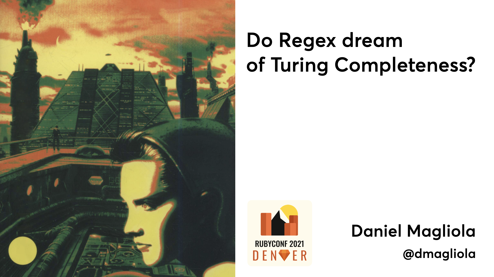

# regex_game_of_life

Companion code and other information for my Rubyconf 2021 talk 
["Do Regex dream of Turing Completeness?"](https://rubyconf.org/program/sessions#session-1239)  
(also presented previously in 
[Rubykaigi 2021](https://rubykaigi.org/2021-takeout/presentations/dmagliola.html))

Here you can find all the code examples mentioned in the talk, the slides deck, and some more explanation
especially of the Regex Turing Machine.

## Slides

[Slides deck from the talk](Slides.pdf)  

## Game of Life

There are 3 implementations of Game of Life:

- `standard_gol.rb`: The usual, "boring" way to do it, with a few nested loops running the game.
      Present here just to contrast against the Regex versions.
      - As a bonus / easter egg, it includes "high resolution" output using Unicode Braille
        characters, as described in [this Twitter thread](https://twitter.com/dmagliola/status/1429124567109357577).
        To active this, uncomment line `Board.braille_print(board)` and comment the one above.
        You might also want to change `INPUT_FILENAME` at the end to `input_pattern_large.txt`
        
        
- `regex_gol_v1.rb`: First "intermediate" Regex implementation, uses Regex to find which
    cells to change, but flips them using a Ruby block.
    
- `regex_gol_v2.rb`: Final version described on my talk, using named captures to do the
    replacement also using Regex. The new interesting code is in method `add_neighbour_capture` 
    
    
## Regex Turing Machine

`turing_machine.rb`: This repo also includes the implementation of the Regex Turing Machine 
I describe at the end of the talk, where I unfortunately can't go into enough detail on the "how". 
The interesting code is in method `regex_clauses`, and the comments above it describe 
roughly how the "moving the tape left and right" works.

As I mention on the talk, the initial string value contains, in the "head", all the values
I might need to capture to then replace into other parts of the string. These are the different
states the machine can be in (`Q0`, `Q1`, etc), and the different values we might want to
write into the tape (the "valid chars", in my example `B01CXY_`). This lets us get
around the final issue in the Game of Life implementation where I can't count on being able to
capture the values I need. By controlling this part of the string and leaving it constant,
I always have the parts I need, and when matching the head in different states, I can capture
the relevant parts to replace into the `new_state`, `new_cursor` (the value under the head),
`new_left` and `new_right`.

As a reminder, the head of this particular machine looks like this: `#Q0Q1Q2Q3Q10Q20Q30Q99:B01CXY_-Q0:B#`  
(the format is: `#valid_states:valid_chars-cur_state:cursor#`)

The `#` and `:` and `-` characters are arbitrary separators to make it easy to read for humans,
most of them are unnecessary, we only really need the starting and ending `#`s.

In my talk I describe one of the statements in the program:  
`"Q1:B/C->L:Q2"` (if we're state Q1 and the tape has a B, write a C, move left, and switch to state Q2).

For this to happen, we need to capture:
- a `C` into `new_right` (since the head moves left, the value we write ends up to the right of the head after moving), 
- whatever is to the left of the head in `new_cursor` (we move left, the value that was to the left is now the one we're evaluating),
- `Q2` into `new_state`,
- but only if the state is `Q1` and the cursor has a `B`

This results in this Regex clause:  
`(?<new_cursor>\w)#Q0Q1(?<new_state>Q2)Q3Q10Q20Q30Q99:B01(?<new_right>C)XY_-Q1:B#`

- We capture one character at the beginning of the head, and that'll be `new_cursor`
- We then list all the states because that's the shape of our head, but we capture `Q2`
- We also list all the possible values, but we capture `C` into `new_right`
- And then at the very end, after the hyphen, we check that the state is `Q1` and the cursor has a `B`, so that this clause only matches that particular state.

The "replace" part of our Regex is:  
`\k<new_left>#Q0Q1Q2Q3Q10Q20Q30Q99:B01CXY_-\k<new_state>:\k<new_cursor>#\k<new_right>`

### Running / inspecting the machine

Near the end I include 2 different machine definitions, one to duplicate a string of 0's and 1's
(shown on the talk), and one to validate that, in a string of `a`'s, `b`'s and `c`'s, the
number of `c`'s equals the number of `a`'s times the number of `b`'s.

You can choose which one runs by changing the assignments to `MACHINE_DEFINITION` and `INPUT`.

When you run `turing_machine.rb`, file `mega_regex.txt` will get created and will include all the generated 
definitions, which you can inspect and compare to the "program" to understand how it's working internally.
